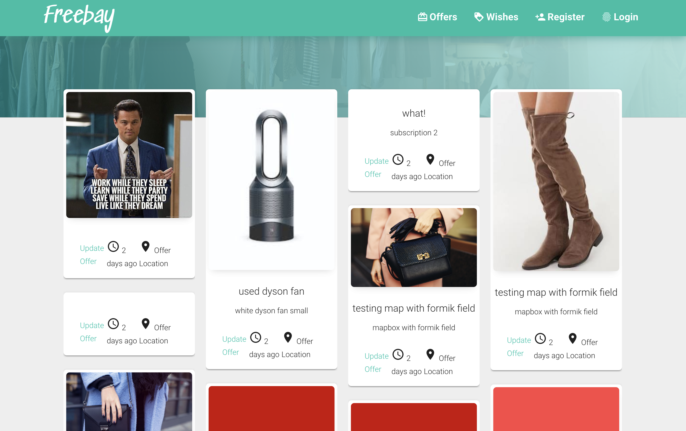

# frby-monorepo




## Tech Stack
 - Typescript
 - GraphQL
 - PostgreSQL
 - Redis
 - React
 - React Native

## Packages
This project is made up of 5 packages that share code using Yarn Workspaces.

- web (React.js website)
- app (React Native app)
- server (GraphQL Typescript server)
- common (Code shared between web, app, and server)
- controller (Components shared between web and app)

## Installation
```
# Clone project
git clone https://github.com/leizleho/freebay-monorepo.git

# cd into folder
cd freebay-monorepo

# download dependencies
yarn

# start postgreSQL
# Create database called graphql-ts-server
createdb graphql-ts-server

# Add a user with the username postgres and and no password. (You can change what these values are in the ormconfig.json)

# Install and start Redis

# Build common packages
yarn build in packages/common

# Build controller packages
yarn build in packages/controller

# Start Server
yarn start in packages/server

# Start Web
yarn start in packages/web
```
